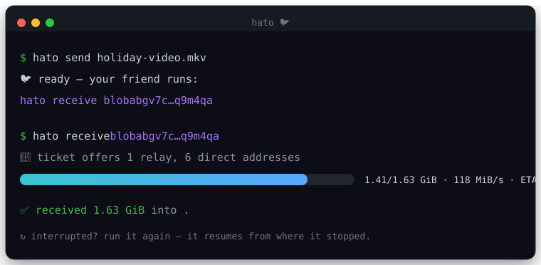

# Hato 🐦

[](https://github.com/StephenSHorton/hato/actions/workflows/ci.yml)
[](./LICENSE)
[](https://github.com/n0-computer/iroh)

**A carrier pigeon for your files.** Fast, free, peer-to-peer file transfer — send a file straight to a friend over the internet. No cloud, no account, no size cap.

Built in Rust on [iroh](https://github.com/n0-computer/iroh): QUIC transport, automatic NAT hole-punching, a free relay fallback, and end-to-end encryption where each side's key *is* its identity. The file streams **directly** between the two machines and **resumes** if the connection drops (BLAKE3 verified streaming), so multi-gigabyte sends are safe.

<p align="center"></p>

## Demo

**Sender** — point `hato` at a file (or folder); it prints a ticket and starts serving:

```console
$ hato send holiday-video.mkv
🐦  ready — your friend runs:

        hato receive blobabgv7c…q9m4qa

    (keep this window open; press Ctrl+C when you're done)
```

**Receiver** — paste the ticket; the file arrives with a live progress bar:

```console
$ hato receive blobabgv7c…q9m4qa
🔗  ticket offers 1 relay(s), 6 direct address(es)
 ⠹ [00:00:12] [==========================>---]  1.41 GiB/1.63 GiB  118 MiB/s  ETA 00:00:02
✅  received 1.63 GiB into .
```

If the transfer is interrupted, just run the same command again — it picks up where it left off:

```console
$ hato receive blobabgv7c…q9m4qa
↻  resumed — 1.41 GiB were already downloaded
✅  received 1.63 GiB into .
```

## Why hato

- **Direct & private** — bytes flow peer-to-peer, end-to-end encrypted. When the two machines can't reach each other directly, iroh falls back to a free relay automatically.
- **No size cap, safe to resume** — content is BLAKE3-verified as it streams, so an interrupted multi-GB send resumes from exactly where it stopped, even after a crash.
- **Zero setup** — no account, no server to run, no port forwarding.
- **Just a file transfer** — no upload to someone else's cloud that lingers, gets indexed, or expires behind a paywall.

## Install

**Latest download:** [GitHub Releases](https://github.com/StephenSHorton/hato/releases/latest)

| Asset | |
| --- | --- |
| `hato-*-windows-amd64-installer.exe` | Per-user NSIS installer (no UAC) — desktop app |
| `hato-*-windows-amd64.zip` | Portable `Hato.exe` (GUI) + `hato.exe` (CLI) |

Grab the latest from **[Releases](https://github.com/StephenSHorton/hato/releases/latest)**.

### From source

Needs a recent stable [Rust](https://rustup.rs) (1.91+). For the GUI installer locally you also need [NSIS](https://nsis.sourceforge.io/) and the Tauri CLI (`cargo install tauri-cli --version "^2"`).

```sh
# clone + build CLI
git clone https://github.com/StephenSHorton/hato
cd hato
cargo build --release -p hato-cli
# binary: target/release/hato

# GUI (dev)
cargo run -p hato-gui

# GUI + NSIS installer (release)
cd crates/hato-gui && cargo tauri build --bundles nsis
# installer: target/release/bundle/nsis/*-setup.exe (workspace target/)

# …or install the CLI onto your PATH from GitHub
cargo install --git https://github.com/StephenSHorton/hato hato-cli
```

## Release

```sh
git tag vX.Y.Z
git push origin vX.Y.Z
```

Tag push runs [`.github/workflows/release.yml`](.github/workflows/release.yml): builds the CLI + Tauri GUI, packs an NSIS installer, and publishes `hato-*-windows-amd64-installer.exe`, a portable zip, and `SHA256SUMS` on the GitHub Release (same shape as [Toru](https://github.com/StephenSHorton/toru/releases)).

## Usage

### Contacts (pair once, then send without codes)

After a one-time pairing, you can send to a named machine whenever both sides are online:

```sh
# Machine A — host a pair code (needs the mailbox running for this step only)
hato pair --name "Stephen's Mac"

# Machine B — join with the spoken code
hato pair join 7-arcade-otter --name "Alice's PC"

# Later: Alice stays reachable…
hato listen --dir ~/Downloads

# …and Stephen sends without any ticket or code
hato send --to alice ./holiday.mkv
```

- **`hato pair` / `pair join`** exchange stable iroh endpoint ids over the same SPAKE2 mailbox as short codes (one online guess; wrong code aborts).
- **`hato listen`** accepts offers **only** from the contact book (unknown peers are rejected).
- **`hato send --to <contact>`** dials that contact, delivers a ticket privately, and waits until they finish.
- **`hato me`** shows your display name + endpoint id; **`hato contacts list|rename|remove`** manages the book.
- Identity lives under the platform config dir (macOS: `~/Library/Application Support/hato/`). Override with `HATO_CONFIG_DIR` for tests or portable installs.

### Short codes (one-shot, no pairing)

```sh
hato code <PATH>              # send; prints a code like  7-arcade-otter
hato get  <CODE> [DIR]        # redeem the code; download into DIR
```

`code`/`get` (and `pair`) run a SPAKE2 handshake through a small rendezvous **mailbox** so the
code stays short *and* secure (a wrong code aborts — see [Security](#security)).
The mailbox isn't hosted yet, so for now run one locally (`cargo run -p hato-mailbox`)
and point both sides at it with `--mailbox ws://127.0.0.1:8080/v1/ws` or `HATO_MAILBOX`.

### Raw tickets (no mailbox needed — always works)

```sh
hato send <PATH>              # send a file or folder; prints a ticket
hato send --relay <PATH>      # force the transfer through iroh's relay (see below)
hato receive <TICKET> [DIR]   # download into DIR (default: current directory)
```

- **`send`** (without `--to`) imports the path (referencing it in place — it does not copy your file) and serves it until you press **Ctrl+C**. Keep the window open until your friend has it.
- **`receive`** connects with the ticket, downloads, and writes the file(s) into `DIR`. Re-running the same ticket resumes an interrupted download.
- **`--relay`** mints a *relay-only* ticket with no direct addresses, forcing the connection through iroh's relay servers. Handy for testing the cross-internet path, or when you already know direct connectivity won't work.

There's also a **desktop GUI** (`cargo run -p hato-gui`) — drag-drop to send, paste a ticket to receive, with a live progress bar. (Contacts UI is CLI-first for now.)

## How it works

```
 hato send                                            hato receive
 ─────────                                            ────────────
 file ──▶ import into on-disk store (BLAKE3 hashed)
           │
           ├─▶ BlobTicket  =  EndpointAddr + hash ───▶ (paste the ticket)
           │                                                │
           └─▶ serve over iroh  ◀───── QUIC, hole-punched ──┘
                                 ◀───── or relay fallback ───┘
                                        end-to-end encrypted
                                        verified-streaming (resumable)
```

1. `hato send` imports your file into a local [iroh-blobs](https://github.com/n0-computer/iroh-blobs) store, which content-addresses it with a BLAKE3 hash, and starts an iroh endpoint serving it.
2. The **ticket** is that endpoint's address plus the hash. iroh's address includes a relay URL and any directly-reachable IPs.
3. `hato receive` opens a QUIC connection to the sender — hole-punched directly when possible, or through a relay when not — then downloads the missing byte ranges. Because every range is BLAKE3-verified, a re-run only fetches what's still missing.
4. Encryption is intrinsic: each iroh endpoint's ed25519 key *is* its TLS identity, so the transfer is authenticated and end-to-end encrypted with no extra setup.

## Roadmap

- [x] **Phase 0** — spike: send/receive over iroh, byte-verified
- [x] **Phase 1** — CLI: real progress + ETA, folders, crash-safe resume, relay-only mode
- [x] **Phase 2** — short human-readable codes (`7-arcade-otter`) via SPAKE2 over a WebSocket mailbox
- [x] **Phase 3** — Tauri desktop GUI: drag-drop send, paste-to-receive, live progress
- [x] **Phase 4** — contacts: persistent identity, pair once, `listen` + `send --to`

Remaining polish: **host the rendezvous mailbox** (so short codes / pairing work with no local server), GUI contacts + system tray, and QR. See [`docs/phase2-shortcodes.md`](docs/phase2-shortcodes.md) for the short-code design and threat model.

## Security

The transport is as strong as iroh's: QUIC + TLS 1.3, each endpoint authenticated by its ed25519 key. **A ticket is a bearer credential** — anyone who has it can fetch the file until you stop serving (Ctrl+C), so share it over a channel you trust.

**Short codes** use a PAKE (SPAKE2), so a short code is safe *by construction*: nothing decryptable is ever stored on the mailbox, the server stays zero-knowledge, and a wrong code (or a man-in-the-middle) gets exactly one online guess before the handshake aborts — no file, no ticket. Both ends can also read a two-word "verify aloud" string to shut out an attacker who overheard the code. Full threat model in [`docs/phase2-shortcodes.md`](docs/phase2-shortcodes.md).

## Development

```sh
cargo build            # build the workspace
cargo test             # run unit tests
cargo clippy -- -D warnings
cargo fmt --all
```

CI runs `fmt`, `clippy -D warnings`, and `test` on Linux and Windows for every push and PR.

## Workspace

- [`crates/hato-core`](crates/hato-core) — the transport + transfer library (iroh + iroh-blobs)
- [`crates/hato-cli`](crates/hato-cli) — the `hato` command-line app
- [`crates/hato-code`](crates/hato-code) — the short-code protocol (SPAKE2 + XChaCha20-Poly1305 over a WebSocket mailbox; no iroh dependency)
- [`crates/hato-mailbox`](crates/hato-mailbox) — the axum WebSocket rendezvous server (zero-knowledge)
- [`crates/hato-gui`](crates/hato-gui) — the Tauri v2 desktop app

## Acknowledgements

Stands on the shoulders of [n0-computer](https://n0.computer)'s [iroh](https://github.com/n0-computer/iroh) and [iroh-blobs](https://github.com/n0-computer/iroh-blobs), and takes direct inspiration from their [`sendme`](https://github.com/n0-computer/sendme) and from [magic-wormhole](https://github.com/magic-wormhole/magic-wormhole).

## License

[MIT](./LICENSE)
